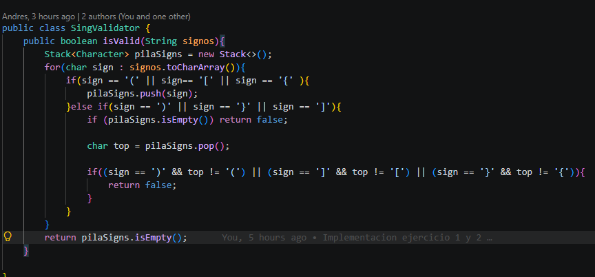
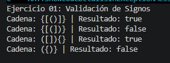
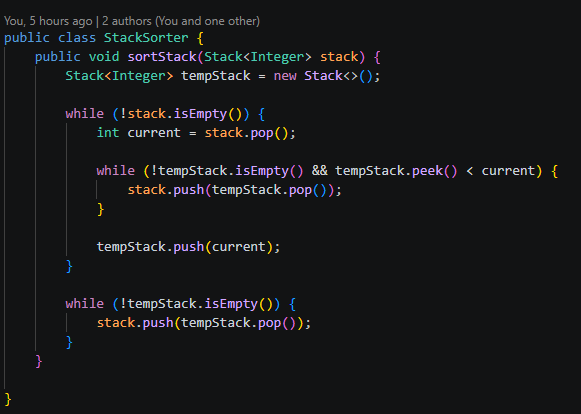
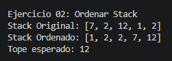
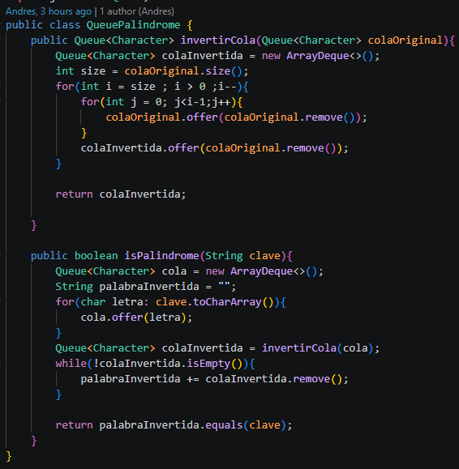
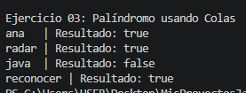
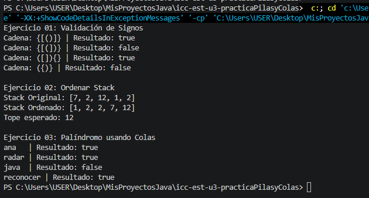

# Práctica: Ejercicios de logica con estructuras lineales: pilas y colas

## Datos del Grupo
- **Nombres:**  Cristopher Carangui, Andres Zuñiga y Nicolas Aguilar.
- **Curso:** Estructura de Datos
- **Fecha:** 12/06/2026

---

## 1. Proyecto
La practica realizada en clases nos permitio poner a prueba lo aprendido en clases sobre pilas y colas, trabajando en equipo, resolviendo los problemas con ideas para tener exito en la ejecucion de los ejercicios.

## Ejercicio1
## Descripción:
Se nos pide un validor de signos en el cual se debe seguir unos paramentros que cada simbolo de cierre debe corresponder al tipo correcto de apertura.
Para este ejercicio nosotros decidimos instanciar la pila comezando con un bucle for para recorrer los signos y obtener cada uno de ellos pasando con condicionales if para coger cada signo de apertura y de cerrado y mostrnado en consola si cumple con los parametros true sino un false 
## Ejercicio2
## Descripción:
El segundo ejercicio se ordena una pila de numeros desordenados, como en el ejercicio anterios se instancia la pila.Se vuelve a usar un bulce en este caso while el cual va ordenado la pila hasta el ultimo numero el cual se mostrara como el tope esperado .
## Ejercicio3
## Descripción:
Un ejercicio donde se  evalua si una palabra es palindroma con varios parametros para poder resolver en codigo, para poder invertir una palabra unicamente haciendo uso de colas nosotros aplicamos un metodo que invierte la cola haciendo uso de 2 for anidados, uno que recorra la cola desde el final hasta el inicio la palabra , y el segundo será el encargado de decidir cuántas veces debemos avanzar para obtener el valor correcto à invertir y con eso se instancia el metodo pedido para obtener un resultado de true si es palindroma y false si no es.
## Tabla de evidencias requeridas
| Ejercicio| Evidencia de Codigo | Evidencia de consola | Observacion|                                                                                                                         |
| ----------------: | -------------------------: | ---------------------: | -------------------- | ------------------------------------------------------------------------------------------------------------------------------------ |
|            Ejercicio1:Validacion de signos|                     |                 | Se obtuvo los resultados requeridos                                                          |
|            Ejercicio2: Ordenar Stack|                     |                 |Se ordena bien la pila requerida                                        |
|           Ejercicio3: Palindromo usando colas|                  |                |Se reconoce un palindromo  |

## Salida en consola

## Conclusiones
Con todo lo aprendido en clases nuestro grupo, pudimos resolver los ejercicios propuestos con los principios de LIFO y FIFO, podrando cada ejercicio con distintos casos de entradas, garantizando el orden secuencial en cada proceso.

La practica nos ayudo a resolver problemas en equipo, facilitando una compresion en el codigo y un intercambio de iseas de cada uno sobre su logica para resolver los ejercicios , identificando errores o ideas que cada uno puede utilizar en futuras practicas o tareas en clases.

Se pudo observar el uso adecuado de estructuras lineales no solo mejora el orden de la información, sino que optimiza el rendimiento del código al evitar recorridos innecesarios en la memoria.

